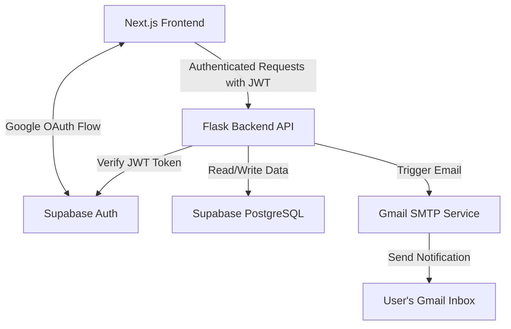

# TaskFlow AI - Task Management System

A full-stack collaborative task management application where users can register/login using Google OAuth, create tasks, assign tasks to team members, and receive automatic Gmail notifications on task creation and completion.

---

## Architecture

Here is the high-level architecture of the application:



### Component Details

1.  **Frontend (Next.js + TypeScript + TailwindCSS)**:
    *   Uses **Supabase JS SDK** to handle user login, session management, and Google OAuth 2.0.
    *   Protects dashboard page on the client-side by checking the active user session.
    *   Retrieves the JWT (`access_token`) from the user session and attaches it to the `Authorization: Bearer <token>` header of every API call to the backend.
2.  **Backend (Python Flask)**:
    *   A REST API that exposes endpoints for fetching, creating, and updating tasks.
    *   Utilizes a custom decorator `@require_auth` in `auth.py` to intercept incoming requests, extract the Bearer token, and verify it against Supabase's user verification endpoint (`/auth/v1/user`).
    *   Interacts with Supabase PostgreSQL database to persist and update tasks.
3.  **Database (Supabase PostgreSQL)**:
    *   Has a `profiles` table synced with Supabase's internal `auth.users` via a PostgreSQL trigger (`on_auth_user_created`).
    *   Has a `tasks` table with Row Level Security (RLS) configured to secure data access.
4.  **Notifications (Gmail SMTP)**:
    *   Integrates with Gmail's SMTP server (`smtp.gmail.com:587`) using Python's built-in `smtplib` library.
    *   Requires a Google **App Password** for secure programmatic email dispatching.

---

## Database Schema (`/migrations`)

The `/migrations/01_init.sql` file defines the database structure:
*   **`profiles`**: Synchronizes automatically with Supabase auth metadata. Keeps track of users' email and profile details to allow assigning tasks.
*   **`tasks`**: Stores task details including `title`, `description`, `status` (`pending`, `completed`), `created_by`, and `assigned_to` foreign keys linking to users.
*   **RLS Policies**: Restricts task modification permissions. Only creators or assignees can view/edit tasks.

---

## Local Setup Instructions

### 1. Database Setup
1. Create a new project on [Supabase](https://supabase.com/).
2. Navigate to the **SQL Editor** in Supabase and run the queries inside `migrations/01_init.sql`.
3. In Supabase under **Authentication** -> **Providers**, enable **Google** and configure the OAuth credentials (see Supabase docs for setting up Google OAuth redirect URLs).

### 2. Backend Setup
1. Open a terminal in `backend/`.
2. Create and activate a Python virtual environment:
   ```bash
   python -m venv venv
   # On Windows:
   .\venv\Scripts\activate
   # On macOS/Linux:
   source venv/bin/activate
   ```
3. Install dependencies:
   ```bash
   pip install -r requirements.txt
   ```
4. Copy `.env.example` to `.env` and configure:
   ```env
   SUPABASE_URL=https://your-project.supabase.co
   SUPABASE_KEY=your-supabase-anon-key
   GMAIL_USER=your-gmail-address@gmail.com
   GMAIL_APP_PASSWORD=your-gmail-app-password
   ```
5. Run the server:
   ```bash
   python app.py
   ```

### 3. Frontend Setup
1. Open a terminal in `frontend/`.
2. Install the required Node packages:
   ```bash
   npm install
   ```
3. Copy `.env.example` to `.env.local` and configure:
   ```env
   NEXT_PUBLIC_SUPABASE_URL=https://your-project.supabase.co
   NEXT_PUBLIC_SUPABASE_ANON_KEY=your-supabase-anon-key
   NEXT_PUBLIC_API_URL=http://localhost:5000
   ```
4. Run the development server:
   ```bash
   npm run dev
   ```

---

## Key Interview Questions to Prepare For

1.  **How is Google OAuth integrated?**
    The frontend calls `supabase.auth.signInWithOAuth({ provider: 'google' })` which redirects the user to Google. On success, Google redirects them back with an access token. Supabase stores this session in local storage.
2.  **How is security handled between Frontend and Backend?**
    Every request to the Flask API includes the `access_token` (JWT) from the user's Supabase session. Flask validates this token by calling Supabase's `/auth/v1/user` endpoint. If valid, the backend trusts the user identity.
3.  **Why do we have a `profiles` table?**
    Supabase's auth data resides in a private schema (`auth.users`) which cannot be directly queried by our frontend to list users for assignment. We set up a PostgreSQL trigger that automatically copies new users from `auth.users` to a public `profiles` table on signup.
